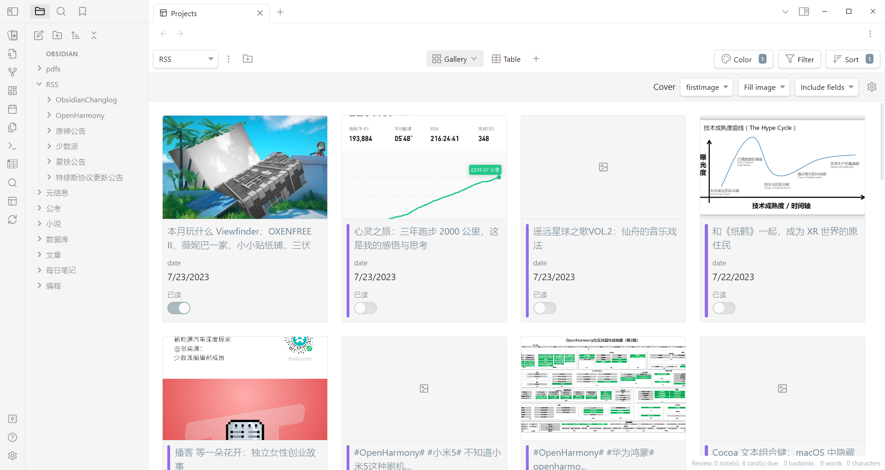

# Obsidian RSS Copyist Plugin

## Usage

Create a folder to represent a subscription. Place the feed.md file and template.md file in its root directory to represent subscriptions and templates. 

You can also create a new folder to form a nested structure to organize these subscriptions. At this time, if there is no template.md file in the root directory of a subscription folder, it will search in the upper-level directory.

## With Projects Plugin



Use the Projects plugin for visualization. set up:

- Added meta information to the template indicating the date published, read, and the first image in the body.
- Create a gallery view, select the first image in the body as the cover.
- Sort by publish time, from newest to oldest.
- Set a color for unread articles for easy viewing and confirmation.

## My Template

```
---
url: {{item.link}}
author: {{item.author}}
date: {{item.pubDate}}
firstImage: {{item.firstImage}}
unread: true
---
{{item.content}}
```

## Feed.md Example

```
---
url: https://rsshub.app/sspai/index
newestNum: 10
---
```